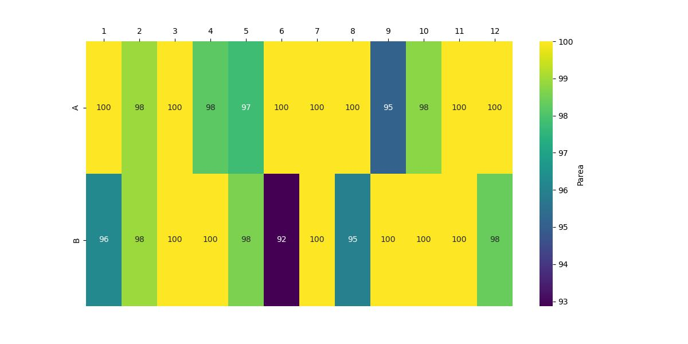

Using the Example Dataset
===========================

Introduction
--------------

To help you get started, an example dataset from a Waters machine is provided in the repository 
under the folder "example_dataset". 

Included are:
	* An "example_rpt" file, which includes the LCMS traces for 24 compounds published in the public domain.
	* An "example_platemap" file, which is the corresponding platemap to enable PyParse analysis of the above data.
	* The output you should expect to see
	
Using the conda environment provided, you can use the sample data to run your first PyParse analysis!

.. code-block::
	:caption: Using the sample Waters dataset provided
	
	python PyParse.py example_dataset/Waters/Example1/example_rpt.rpt example_dataset/Waters/Example1/example_dataset/example_platemap.csv -o example_dataset/Waters/Example1/example_dataset/output -moa area
	
The "-moa area" specifies to the PyParse algorithm that where there are two peaks that 
could correspond to the product, choose the one with the larger percentage peak area. 
	
A different example dataset obtained using a Shimadzu machine is also provided, under the example_dataset/Shimadzu folder. 

.. code-block::
	:caption: Using the sample Shimadzu dataset provided
	
	python PyParse.py example_dataset/Shimadzu example_dataset/Shimadzu/Platemap.csv -o example_dataset/Shimadzu/output -i Shimadzu

Expected Output
-------------------

Once the analysis is complete, navigate to the "example_dataset" folder, where you should find a new sub-folder called output. 
Open this folder, and double-click on the "html_output" file. The HTML report will open, and contain the following
visualisations. 

You can also find these visualisations, and the underlying processed data, in the same subfolder. 

Heatmap
----------

	
	Example Heatmap
	
	
Check to make sure that your heatmap looks the same as the one shown above. If so, you are ready to begin your own 
analyses!!
