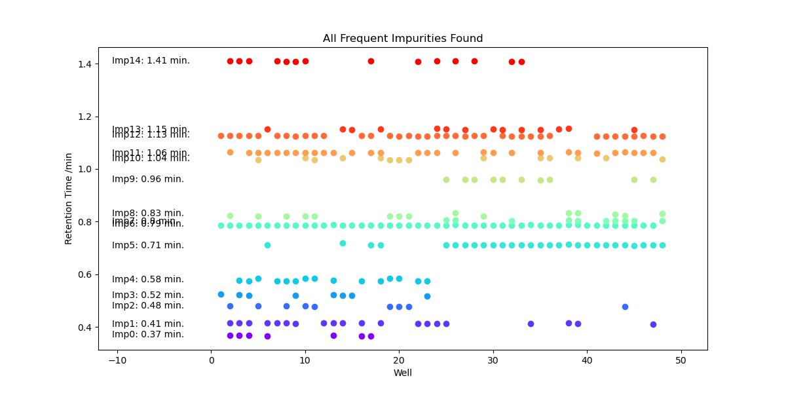

.. _freq_impurity_detection_label:

Automatic Impurity Detection and Reporting
============================================

Background
------------------------

For a plate of reactions, there will typically be at least one reagent which is commonly used
across multiple wells of the plate. With this commonality comes a higher chance that a particular
by-product or side-product (generically termed "impurity" for simplicity) is synthesised across multiple wells. 

Compared to single reactions that compare One Variable At a Time (OVAT), high-throughput experimentation
generates large quantities of data in a single experiment. What was previously a one-off impurity can become 
an observation backed up by data from multiple reactions. 

PyParse, through the hit-validation algorithm, overlays all peaks that weren't assigned to a compound specified 
by the user and identifies those that frequently occur. 

C-H Activation Reaction Optimisation Plate
---------------------------------------------

.. note:: 
    For further details on the reaction optimisation plate described below, see: Mason J., Wilders H., Fallon D.J., Thomas R.P., 
    Bush J.T., Tomkinson N.C.O., Rianjongdee, F.; Automated LC-MS Analysis and Data Extraction for High-Throughput Chemistry; 
    Digital Discovery (2023), 2, 1894 - 1899; https://doi.org/10.1039/D3DD00167A

Using high-throughput experimentation, a small dataset for the C-H activation of an oxazole was prepared and published 
as part of the PyParse repository. 

    Scheme 1. Reaction Design for C-H Activation Optimisation

In the course of running the experiment, it was expected that both regioisomers (R1 and R2) and the bis-substitution side-product
would likely be synthesised in the plate. This was indeed observed and the two regioisomers were confirmed by isolation of the each
product and structure assigned by ROESY (see the open-access paper referenced above for further details).

In v1.1.0 of PyParse, the "find_impurities" function is designed to draw the user's attention to commonly observed impurities.
The goal of this function is to enable the user to generate new hypotheses more quickly than would otherwise be possible, by reporting
the data in a more digestible form. 

The first step of this function is to generate the hit validation graph for all impurities. This graph is independant of any m/z ions 
that were observed at this stage - it simply groups all peaks (that weren't already assigned to compounds specified in the platemap) by their 
retention time. 

    Figure 1. Hit Validation Graph for Reaction Optimisation Plate

In this graph, multiple impurities form lines on the graph at a specific retention times; this consistency 
across multiple wells suggest that the impurity observed in each well may be the same. For example, impurities 6, 13 and 14 
are all observed in numerous wells with a tight retention time. For these impurities, we have both quality data to build confidence 
in any conclusions we draw, and there is a greater expected reward for determining the structure of an impurity which 
consistently hampers the desired transformation. 

We'll start with these impurities and use the impurity table to find the m/z values for each. PyParse **only** reports m/z ions
that were observed in at least 80% of the peaks assigned to that impurity. This helps to filter out the noise so that the user
can focus on key data rather than "red herrings".

.. figure:: images/impurity_table.jpg
    :alt: Impurity Table for reaction optimisation plate

    Table 1. Impurity Table for Reaction Optimisation Plate

At this point, we need to use our knowledge of common chemical transformations to build hypotheses on what these impurities could be.
Starting with impurity 6, a m/z of 225 (ES+) is observed in >80% of the peaks; this is 2 units less than that observed for the desired product 
(R1/2, Scheme 1) and suggests an oxidation mechanism may be in effect. A plausible suggestion is that oxidation of the benzylic alcohol to the 
corresponding aldehyde has occurred. 

.. figure:: images/oxidation_monoalkylation.jpg
    :alt: Scheme for the oxidation of the desired product
    :width: 600

    Scheme 2. Hypothesised Oxidation Scheme of the Desired Product to give Impurity 6

This mechanism is certainly unusual and it must be noted here that any assignments based on m/z values should be followed up with more
robust analytical techniques (e.g. 1H NMR) to verify these conclusions. However, using PyParse in this way has allowed us to more 
quickly identify the retention time and mass of this impurity. 

Using the same technique, we can build a similar hypothesis for impurity 13:

.. figure:: images/oxidation_bisalkylation.jpg
    :alt: Scheme for the oxidation of the bis-substituted side-product
    :width: 700

    Scheme 3. Hypothesised Oxidation Scheme of the Bis-Substituted Side-Product to give Impurity 13

Finally, using knowledge of the Buchwald G3-type precatalysts that were used in certain wells of the reaction optimisation plate (see
cited paper above), PyParse helps us to assign a tentative structure for impurity 14:

    Scheme 4. Hypothesised C-N Cross-Coupling to Generate Impurity 14

This C-N cross coupling side product is not unusual when using the Generation 3 type pre-catalysts: we can hypothesise that using the Generation 4
pre-catalyst instead would help us to further improve the yield of the desired product (R1, scheme 1). 

.. note:: 
    For further details on Generation 4 pre-catalysts, see: Bruno N.C., Niljianskul N., Buchwald S.L.; *N*-Substituted 2-Aminobiphenylpalladium 
    MethaneSulfonate Precatalysts and Their Use in C-C and C-N Cross Couplings; J. Org. Chem. (2014), 79 (9), 4161-4166; https://doi.org/10.1021/jo500355k.

Conclusions
---------------

The PyParse "find_impurity" function is not designed to replace the trained chemist, but instead take advantage of the rich dataset that has been 
generated and highlight key data to the user. Without a doubt, the same process could be performed manually, but would be a tedious and labour-intensive 
process. Using PyParse in this fashion allows new hypotheses to be generated more rapidly and gives back time to the user to focus on cutting edge 
research. 